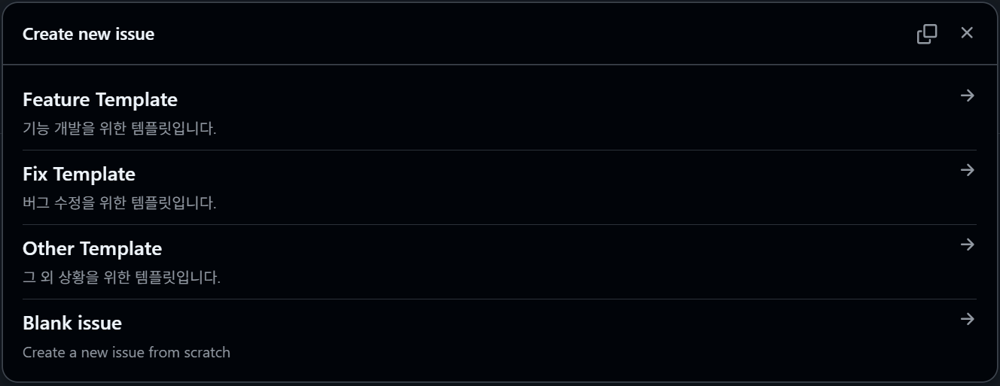
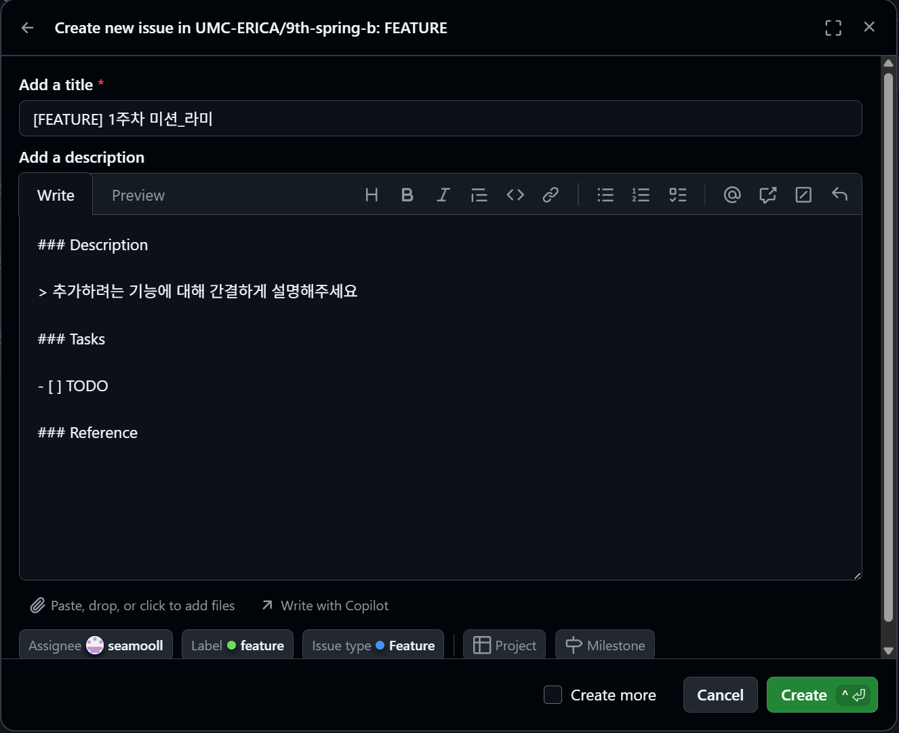
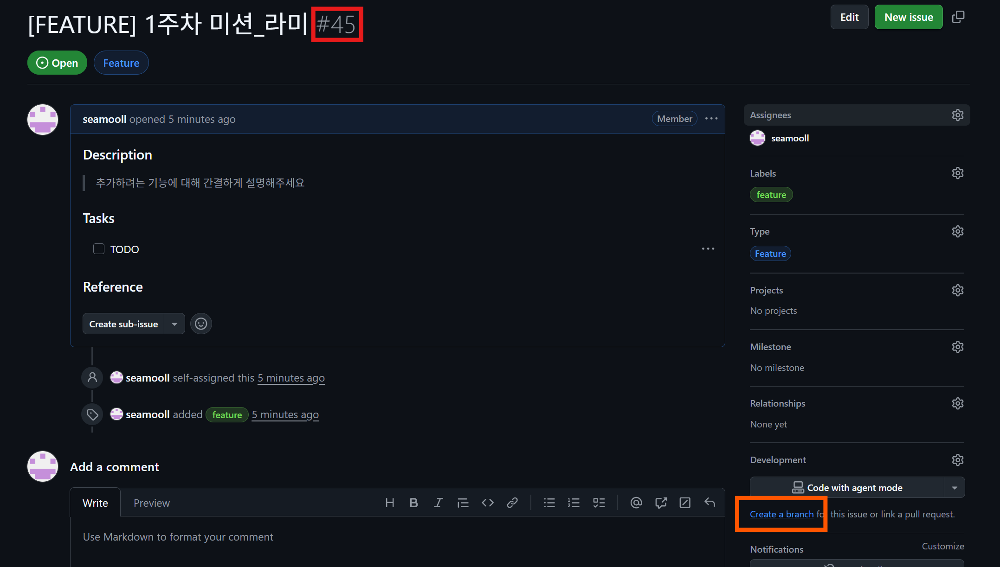

# UMC 10th ERICA Server(Spring)

UMC 10th ERICA Server(Spring) 파트 레포지토리 입니다.

---

### 1️⃣ 본인 닉네임에 해당하는 폴더가 있습니다. 해당 폴더에서 워크북 미션을 진행합니다.

닉네임 폴더 안에 Spring 프로젝트가 각각 생성되어 있습니다. 해당 프로젝트 안에서 미션을 진행하시면 됩니다.

⚠️ 다른 스터디원의 폴더는 참고만 할 뿐, 건드리시면 안됩니다!

### 2️⃣ 이슈를 생성합니다.
1. 깃허브 Issues > New issue 클릭 후, 상황에 맞는 템플릿을 선택합니다.

2. 미션을 위한 이슈 제목은 아래 컨벤션에 맞게 작성합니다.
```
[FEATURE] #주차 미션_닉네임
```
3. 템플릿을 수행할 미션 내용에 맞게 채우고, Assignees에 본인을 지정합니다.

4. 이슈를 생성하면 이슈 번호가 부여됩니다. 이 번호를 브랜치명에 사용합니다.


### 3️⃣ 이슈에서 브랜치를 생성하고 Checkout합니다.
1. 이슈 페이지 우측의 "Create a branch"를 클릭하여 브랜치를 생성합니다. <br> 이렇게 하면 이슈와 브랜치가 자동으로 연결됩니다.
브랜치명 컨벤션은 다음과 같습니다.
```
feat/#{이슈번호}-작업내용
```
2. 브랜치 생성 후 로컬에서 해당 브랜치로 Checkout하여 미션을 진행합니다.


### 4️⃣ 미션을 수행하면서 작성한 코드를 Commit합니다.
❗ Commit 컨벤션은 다음과 같습니다. ❗
```
feat: 새로운 기능 추가
fix: 버그, 오류 수정
refactor: 코드 리팩토링 (기능 변경 없이 코드 구조 개선)
chore: 빌드 설정, 패키지 수정 등 기타 작업

아래는 예시입니다. 

feat: 회원 조회 API 구현 
chore: build.gradle 의존성 추가
fix: createAt, updateAt 적용 안되던 오류 수정
```
### 5️⃣ 해당 주차 실습 및 미션을 완료하셨으면 Push 해주시고, main 브랜치로 Pull Request를 작성합니다.

❗️Pull Request 컨벤션은 다음과 같습니다.❗️

PR 제목:
```
[FEATURE] #주차 미션_닉네임
```

PR 본문:

```
## Summary
- 요약

## Related Issue
- close #이슈번호

## Describe your code
- 코드 설명

## Checklist
- [ ] 리뷰어 등록
```
Related Issue의 close #이슈번호 는 PR이 main에 Merge될 때 연결된 이슈를 자동으로 닫아주는 키워드입니다. 

- **Reviewers**에는 스터디원 전원(파트장 포함)을 지정해주세요.
- **Assignees**에는 PR을 작성한 본인을 지정해주세요.

PR은 ❗️파트장 포함 최소 2명의 Approve를 받아야❗️ Merge 할 수 있도록 설정되어 있습니다.
<br> 따라서  **파트장과 팀원 한 명의 Approve를 받으면 PR을 작성한 본인이 main 브랜치로 Merge를 진행합니다.**

---

> 💬 코드 리뷰를 적극 권장합니다! 

다른 스터디원의 코드를 보며 얻는 것이 생각보다 많습니다. <br>

궁금한 내용이나 함께 이야기하고 싶은 것이 있다면 언제든 코멘트로 남겨주세요.
본인 제외 다른 스터디원의 PR에 2개 이상의 코멘트를 남기는 것을 적극 권장합니다. 🙌 

